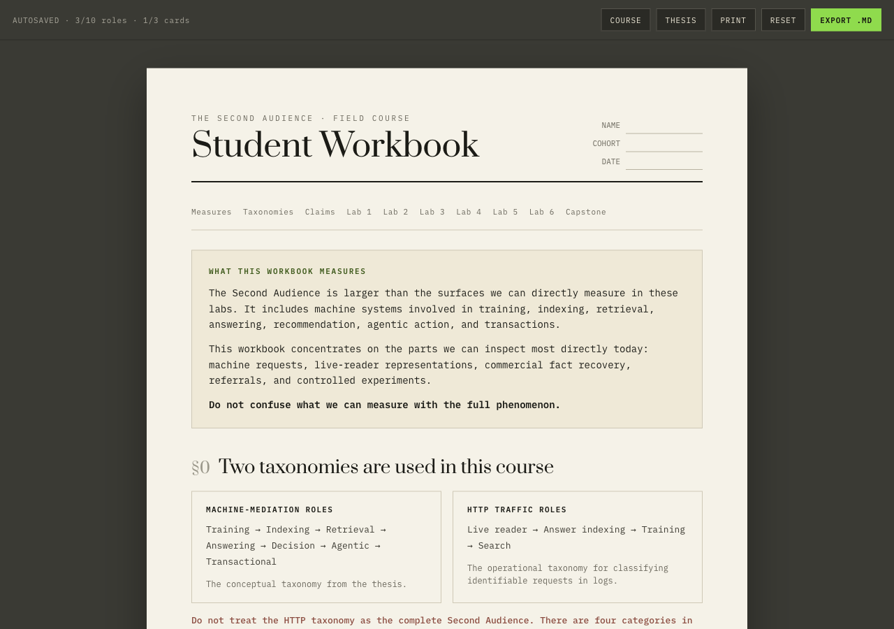

# The Second Audience - Student Workbook

Interactive field workbook for measuring how machines read, represent, and act on companies across the web.

**Not a PDF.** A fillable UI with autosave, print styles, and Markdown export.

> Where measurement is narrower than the phenomenon, the thesis wins.

<p align="center">
  
</p>

## Why this exists

Most “AI visibility” content collapses the Second Audience into whatever is easy to count in server logs.

This workbook teaches a measurement discipline instead:

1. Map the mediation layer (Training → Transactional)
2. Classify HTTP traffic roles without pretending they are the whole phenomenon
3. Score commercial fact recovery (consumability after access)
4. Separate discoverability from consumability
5. Design one-variable experiments and label claims honestly

Companion to the course and thesis:

- Course: [audiencetwo.com/second-audience](https://audiencetwo.com/second-audience)
- Thesis: [audiencetwo.com/second-audience/thesis](https://audiencetwo.com/second-audience/thesis)
- Public brand sheets: [observe.audiencetwo.com](https://observe.audiencetwo.com)

## Quick start

```bash
npm install
npm run dev
```

Open the local URL Vite prints (usually `http://localhost:5173/second-audience-workbook/`).

## What students get

| Feature | Details |
|---------|---------|
| Autosave | Answers persist in `localStorage` |
| Lab 1 | Classify 10 user-agent tokens by role |
| Lab 2 | Score Brooklinen / Bombas / Unbound recovery cards |
| Lab 3-6 | Archetypes, surfaces, consumability draft, one-variable experiment |
| Capstone | Full loop with epistemic close |
| Export | Download answers as Markdown |
| Print | Clean paper print stylesheet |

## Deploy (GitHub Pages)

```bash
npm run deploy
```

Uses `base: /second-audience-workbook/` by default. For a custom domain or root deploy:

```bash
VITE_BASE=/ npm run build
```

## Design

Visual system from the AudienceTwo field-course design:

- Paper sheet on olive ground (`#f5f2e8` / `#3a3a34`)
- **Prata** for display, **IBM Plex Mono** for body
- Accent lime `#8fdb4d` for hero metric and caution

## Star if this helped

If you use this in a team, agency, or classroom, star the repo and open an issue with a brand sheet you want added to the public study.

## License

MIT
